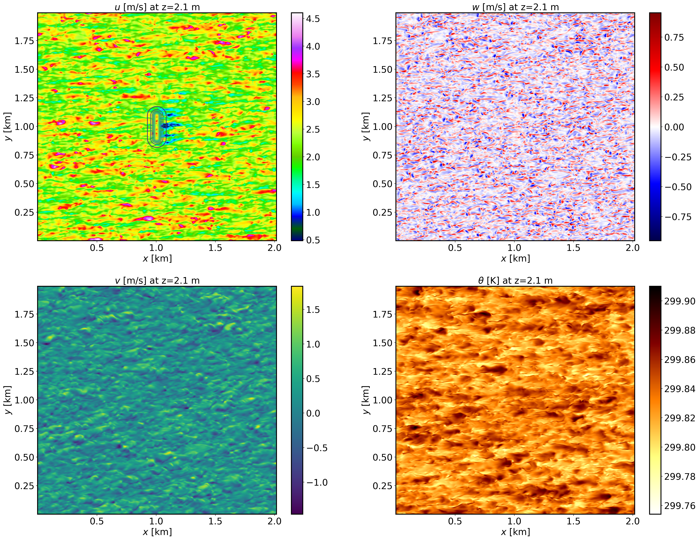

==================================================
Transport and dispersion over idealized topography
==================================================

Background
----------

This is an example of transport and dispersion of a scalar in the presence of idealized topography. The idealized terrain is based on the Witch of Agnesi, and a passive tracer is released on the lee side of the hill.

Input parameters
----------------

* Number of grid points: :math:`[N_x,N_y,N_z]=[504,498,90]`
* Isotropic grid spacings in the horizontal directions: :math:`[\Delta x,\Delta y]=[4,4]` m, the minimum vertical grid at the surface is :math:`\Delta z=3.6` m and stretched with verticalDeformFactor :math:`=0.26`
* Domain size: :math:`[2.16 \times 1.99 \times 1.44]` km
* Model time step: :math:`0.01` s
* Advection scheme: 5th-order upwind
* Time scheme: 3rd-order Runge Kutta
* Geostrophic wind: :math:`[U_g,V_g]=[8,0]` m/s
* Latitude: :math:`54.0^{\circ}` N
* Surface potential temperature: :math:`300` K
* Potential temperature profile:

.. math::
  \partial{\theta}/\partial z =
    \begin{cases}
      0 & \text{if $z$ $\le$ 500 m}\\
      0.003 & \text{if $z$ > 500 m}
    \end{cases} 

* Rayleigh damping layer: uppermost :math:`600` m of the domain
* Initial perturbations: :math:`\pm 0.25` K 
* Depth of perturbations: :math:`375` m
* Top boundary condition: free slip
* Lateral boundary conditions: periodic
* Time period: :math:`1` h

Execute FastEddy
----------------

Note that this example requires customization of the initial condition file. The first step consists in runnig for 1 timestep to create the *FE_DISPERSION.0* file. After that, exectue the Jupyer notebook provided in **/tutorial/notebooks/Dispersion_Prep1.ipynb** to create the topography file *Topography_504x498.dat*. Run again for 1 timestep but pointing to the generated binary file containing the terrain information in the FastEddy parameter file (:code:`topoPos`). This will create a new initial file *FE_DISPERSION.0* that contains the toography and with the terrain-following vertical grid correspondingly adjusted. Then, exectute the Jupyer notebook provided in **/tutorial/notebooks/Dispersion_Prep2.ipynb** to modify the surface roughness distribution over some portion of the hill. Execute the Jupyer notebook provided in **/tutorial/notebooks/Dispersion_Prep3.ipynb** to create the input file required for the source specification. Now, point to the modified initial condition file (:code:`inPath`, :code:`inFile`) and the generated passive tracer source file (:code:`srcAuxScFile`, release starts :math:`45` min into the simulation) and run FastEddy for the :math:`1` h of the simulation by changing :code:`frqOutput`, :code:`Nt`, and :code:`NtBatch` back to their original values. Two FastEddy simulation setup are provided for this tutorial, corresponding to weakly stable (*Example07_DISPERSION_SBL.in*) and convective conditions (*Example07_DISPERSION_CBL.in*). The initial condition and terrain preparation stepts only need to be carried out once, then reused to run the other stability case.

See :ref:`run_fasteddy` for instructions on how to build and run FastEddy on NSF NCAR's High Performance Computing machines.

Visualize the output
--------------------

Open the Jupyter notebook entitled *MAKE_FE_TUTORIAL_PLOTS.ipynb* and execute it using setting: :code:`case = 'dispersion'`.

XY-plane views of instantaneous velocity components and potential temperature for the SBL case at :math:`t=1` h (FE_DISPERSION.360000). The contour lines in the :math:`u` panel display terrain elevation:

XY-plane views of instantaneous velocity components and potential temperature for the CBL case at :math:`t=1` h (FE_DISPERSION.360000). The contour lines in the :math:`u` panel display terrain elevation:

.. image:: ../images/UVWTHETA-XY-dispersion_CBL.png
  :width: 1200
  :alt: Alternative text

XY-plane views of instantaneous plume dispersion for the SBL case at :math:`z=30` m AGL and different times (:math:`t=50,55,60` min), corresponding to the windward release:

XY-plane views of instantaneous plume dispersion for the CBL case at :math:`z=30` m AGL and different times (:math:`t=50,55,60` min), corresponding to the windward release:

YZ-plane views of instantaneous plume dispersion for the SBL case at several downstream distances (:math:`t=1` h, FE_DISPERSION.360000), corresponding to the windward release:

YZ-plane views of instantaneous plume dispersion for the CBL case at several downstream distances (:math:`t=1` h, FE_DISPERSION.360000), corresponding to the windward release:

Analyze the output
------------------

* How does the terrain impact gets altered by the different stability conditions?
* What are the differences in plume dispersion between stable and convective condtions?
* How does downstream distance affect structure of the plume?
